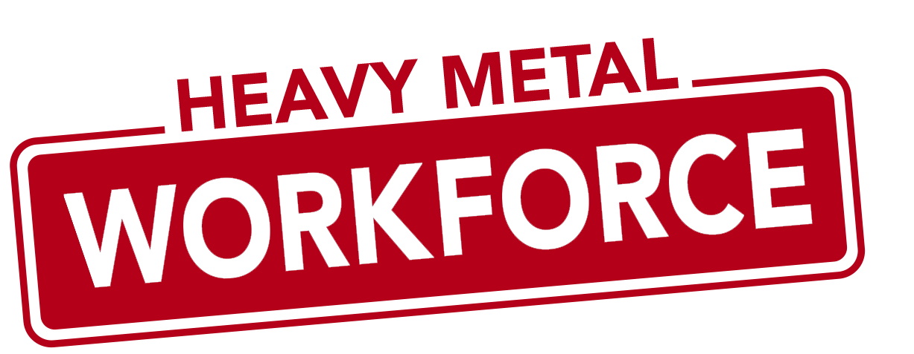

# Heavy Metal Workforce

Liebe Kolleg*innen,
wir möchten euch unsere Wahlvorschlagsliste „Heavy Metal Workforce“ vorstellen,
mit der wir zur Betriebsratswahl bei EMP am 18.06.2024 antreten.

EMP hat seine Wurzeln in der Heavy Metal Fankultur,
und wir fühlen uns diesen Ursprüngen und den Werten dieser Szene wie Bodenständigkeit,
Authentizität und Zusammenhalt eng verbunden.

Der englische Begriff „Workforce“ bedeutet übersetzt nichts anderes als „Belegschaft“,
denn wir sind alle stolz darauf ein Teil der EMP-Crew zu sein und mit euch allen zusammenarbeiten zu dürfen.

Wir legen großen Wert auf eine Zusammenarbeit auf Augenhöhe.
Wir wollen keine Egos, keine Spielchen und keine Schuldzuweisungen.
Es ist uns wichtig, dass sich die Mitglieder des Betriebsrats aus möglichst vielen Abteilungen
und Teams zusammensetzen und wir viele verschiedene Meinungen und Blickwinkel auf unsere Arbeitsplätze erhalten.

Für uns ist es besonders wichtig, jederzeit für euch da zu sein.
Wir stehen euch bei Konflikten mit Kollegen und Vorgesetzten zur Seite, begleiten euch zu Mitarbeitergesprächen,
hören immer aufmerksam zu und arbeiten diskret mit euch an Lösungen für eure Anliegen.

Wir danken euch für euer Vertrauen, und hoffen auf eure Unterstützung bei der anstehenden Wahl.

Miteinander, Füreinander, EMP.

Eure „Heavy Metal Workforce
